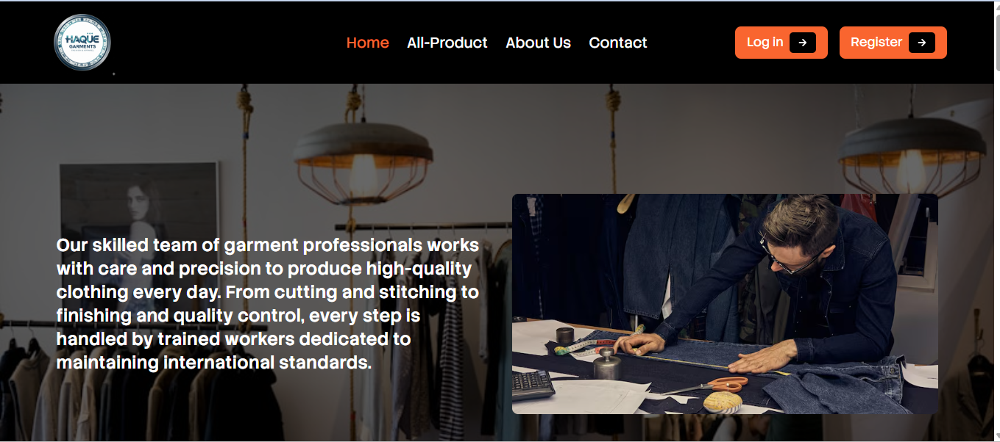

  

Haque Garments

📌 Project Purpose

I have created a website named Haque Garments, which works as a complete online garments store.
In this website, the manager can easily add, update, and manage products. Each product includes images, price, and detailed descriptions.

Buyers can browse different types of garments available on the site. The website has a simple and user-friendly interface, making shopping easy for everyone. Customers can select their desired products and place orders smoothly. The system ensures a secure and reliable buying process.

Overall, this website helps make the garments business more digital, organized, and efficient.

🔗 Live Demo

https://final-porject-garments.web.app/

🛠️ Technologies Used

React.js

Firebase

Tailwind CSS

Daisy UI

React Router

React Toastify

Netlify

Framer Motion

MongoDB

react-fast-marquee

react-hook-form

🚀 Key Features

Role-based authentication system with Admin, Manager, and Buyer access control

Secure login and registration using Email/Password and Social Login (Google/GitHub)

Admin dashboard to manage users, products, orders, roles, approval, and suspension

Manager dashboard to add products, manage products, approve/reject orders, and update production tracking

Buyers can browse products, view details, place orders, track order status, and view order history

Complete Order & Production Tracking System (Cutting, Sewing, Finishing, QC, Packing, Shipping)

Home page product control – Admin can select which products appear on the home page

Secure backend with JWT/Firebase authentication, protected routes, MongoDB, and environment variables

Responsive and modern UI with Framer Motion animations, dark/light theme, and reusable components

Real-time feedback using Toast/SweetAlert, loading spinners, pagination, search, and filter system

📦 NPM Packages Used

react

react-dom

react-router

react-toastify

firebase

tailwindcss

daisyui

▶️ Getting Started

To get started with this project, follow these simple steps:

Install Dependencies
Navigate to the project folder and run:

npm install

Setup Environment Variables
Create a .env file and add your database and API keys as required.

Start the Development Server
Run the following command to launch the website locally:

npm run dev

Contribute
Make changes or improvements to the code and push updates if needed.
